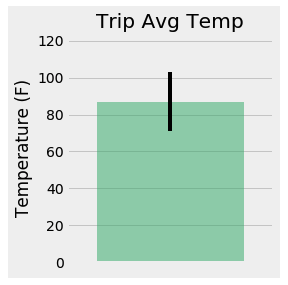
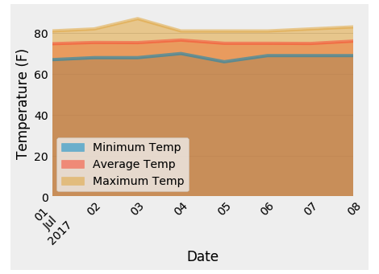

## sqlalchemy-challenge
### Purpose
The purpose of this project was to explore and analyze the weather data in Hawaii to determine when is the best time to visit.
### Step 1 - Climate Analysis and Exploration
All of the following analysis was completed using SQLAlchemy ORM queries, Pandas, and Matplotlib. [(Jupyter notebook link)](https://github.com/changrita1114/sqlalchemy-challenge/blob/main/climate_fyc.ipynb)
* The provided starter notebook and hawaii.sqlite files were used to complete the climate analysis and data exploration.
* A chosen start date and end date for the trip. The vacation range was 3 days (07/01/18 ~ 07/03/18).
* SQLAlchemy create_engine was used to connect to the sqlite database.
* SQLAlchemy automap_base() was used to reflect the tables into classes which saved a reference to those classes called Station and Measurement.
#### Precipitation Analysis
* A query was designed to retrieve the last 12 months of precipitation data.
* The date and prcp values were selected.
* The query results were loaded into a Pandas DataFrame and set the index to the date column.
* The DataFrame values were sorted by date.
* The results were ploted using the DataFrame plot method.
* Pandas was used to print the summary statistics for the precipitation data.

#### Station Analysis
* A query was design to calculate the total number of stations.
* A query was designed to find the most active stations.
* A query was designed to retrieve the last 12 months of temperature observation data (TOBS).
    * The TOBS was filtered by the station with the highest number of observations.
    * The results as a histogram was plotted with bins=12.
    

### Step 2 - Climate App
A Flask API was designed based on the queries which havd developed above. [(Flask APP link)](https://github.com/changrita1114/sqlalchemy-challenge/blob/main/app.py)
* Flask was used to create the routes.
#### Routes
* `/`
  * Home page.
  * List all routes that are available.
* `/api/v1.0/precipitation`
  * Convert the query results to a dictionary using `date` as the key and `prcp` as the value.
  * Return the JSON representation of your dictionary.
* `/api/v1.0/stations`
  * Return a JSON list of stations from the dataset.
* `/api/v1.0/tobs`
  * Query the dates and temperature observations of the most active station for the last year of data.
  * Return a JSON list of temperature observations (TOBS) for the previous year.
* `/api/v1.0/<start>` and `/api/v1.0/<start>/<end>`
  * Return a JSON list of the minimum temperature, the average temperature, and the max temperature for a given start or start-end range.
  * When given the start only, calculate `TMIN`, `TAVG`, and `TMAX` for all dates greater than and equal to the start date.
  * When given the start and the end date, calculate the `TMIN`, `TAVG`, and `TMAX` for dates between the start and end date inclusive.
### Further Analyses
#### Temperature Analysis I
* Hawaii is reputed to enjoy mild weather all year. Is there a meaningful difference between the temperature in, for example, June and December?
* The average temperature in June and December were identified at all stations across all available years in the dataset. Do the same for December temperature.
* A t-test to determine whether the difference in the means.
#### Temperature Analysis II
* The calc_temps function was used to calculate the min, avg, and max temperatures for your trip using the matching dates from the previous year (i.e., use "2017-01-01" if your trip start date was "2018-01-01").
* The min, avg, and max temperature were ploted from the previous query as a bar chart.
    * The average temperature was set as the bar height.
    * The peak-to-peak (TMAX-TMIN) value was set as the y error bar (YERR).
    

#### Daily Rainfall Average
* The rainfall per weather station was calculated using the previous year's matching dates.
* The daily normals, the averages for the min, avg, and max temperatures, were calculated.

### Disclaimer
The resources of this master branch are only for educational purposes. All reserved rights belong to UCSD Data Science and Visualization Boot Camp.
